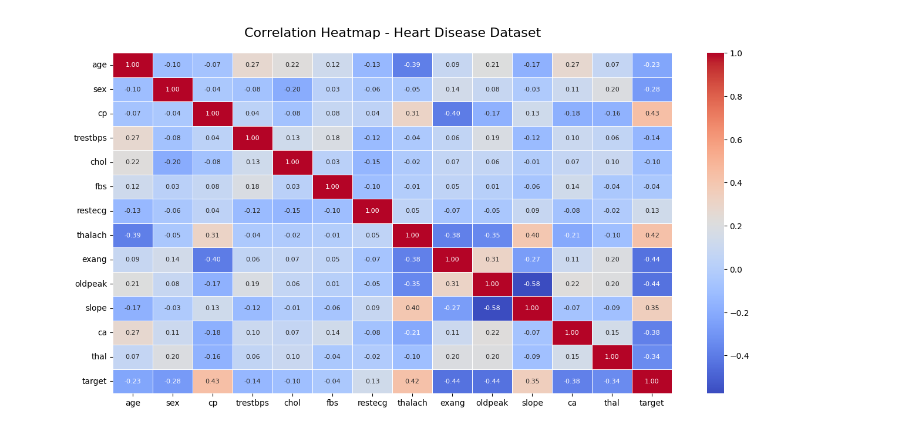

# ❤️ Heart Disease Prediction using Machine Learning

## 📌 Overview
This project is a **Machine Learning-based Heart Disease Prediction System**.  
It uses a dataset containing various health metrics (such as age, blood pressure, cholesterol, etc.) to predict whether a person is likely to have heart disease.  
The goal is to **analyze medical data, preprocess it, train models, and make accurate predictions**.

---

## 📂 Features
- **Data Preprocessing**  
  - Handling missing values  
  - Encoding categorical data  
  - Feature scaling
- **Exploratory Data Analysis (EDA)**  
  - Visualizing data patterns  
  - Correlation analysis
- **Model Training**  
  - Logistic Regression  
  - Decision Tree Classifier  
  - Random Forest Classifier  
  - K-Nearest Neighbors (KNN)
- **Model Evaluation**  
  - Accuracy score  
  - Confusion matrix  
  - Classification report
- **Prediction System**  
  - Input patient details  
  - Predict possibility of heart disease

---

## 🛠️ Technologies Used
- **Python** 🐍
- **pandas** – Data manipulation  
- **numpy** – Numerical operations  
- **matplotlib** & **seaborn** – Data visualization  
- **scikit-learn** – Machine Learning algorithms

---

## 📊 Dataset
The dataset used in this project contains the following columns:
- `age` – Age of the patient  
- `sex` – Gender (0 = Female, 1 = Male)  
- `cp` – Chest pain type  
- `trestbps` – Resting blood pressure  
- `chol` – Serum cholesterol  
- `fbs` – Fasting blood sugar  
- `restecg` – Resting electrocardiographic results  
- `thalach` – Maximum heart rate achieved  
- `exang` – Exercise induced angina  
- `oldpeak` – ST depression induced by exercise  
- `slope` – Slope of the peak exercise ST segment  
- `ca` – Number of major vessels colored by fluoroscopy  
- `thal` – Thalassemia status  
- `target` – Presence of heart disease (0 = No, 1 = Yes)

---

## 🚀 How to Run
1. Clone this repository:
   ```bash
   git clone https://github.com/yourusername/heart-disease-ml.git
2.Navigate to the project folder:
   ```bash
   cd heart-disease-ml
```
3.Install required dependencies:
  ```bash
  pip install -r requirements.txt
```
4.Run the Jupyter Notebook or Python script to train and test the model.

## Screenshot




## 👨‍💻 Author

**Sudhatanmai**

💼 Passionate about Machine Learning, Data Science, and AI solutions.

📧 Email: sudhatanmai2@gmail.com

🌐 GitHub: https://github.com/Sudhatanmai

😊 Thank you for visiting this repository! Hope this project inspires your ML journey 🚀
